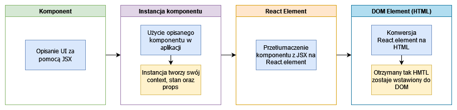
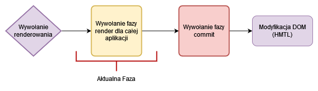
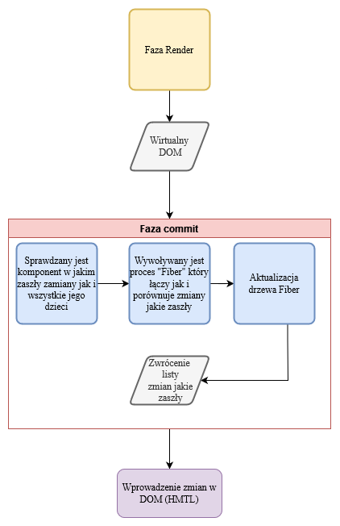

# Opis działania Reacta wewnątrz

## Zagadnienia

- [Opis działania Reacta wewnątrz](#opis-działania-reacta-wewnątrz)
  - [Zagadnienia](#zagadnienia)
    - [Co się dzieje gdy dodajemy komponent do drzewa aplikacji](#co-się-dzieje-gdy-dodajemy-komponent-do-drzewa-aplikacji)
    - [Jak działa renderowanie faza renderowania (The Render Phase)](#jak-działa-renderowanie-faza-renderowania-the-render-phase)
      - [Sytuacje w której faza render jest wywoływana](#sytuacje-w-której-faza-render-jest-wywoływana)
    - [Jak działa renderowanie faza zatwierdzania (The Commit Phase)](#jak-działa-renderowanie-faza-zatwierdzania-the-commit-phase)
    - [Key Prop](#key-prop)
    - [React hooks i ich zasady](#react-hooks-i-ich-zasady)
    - [Optymalizacja](#optymalizacja)
      - [Zapobieganie zbędnym re-renderom możemy uzyskać za pomocą:](#zapobieganie-zbędnym-re-renderom-możemy-uzyskać-za-pomocą)
      - [Poprawienie szybkości aplikacji](#poprawienie-szybkości-aplikacji)
      - [Redukcja wielkości paczki](#redukcja-wielkości-paczki)

---

### Co się dzieje gdy dodajemy komponent do drzewa aplikacji

Komponent posiada kilka faz kiedy jest dodawany do drzewa aplikacji o to jakie fazy rozpoznajemy:

1. `Komponent` - faza w której komponent istnieje jako funkcja lub klasa zwracająca React Element jako opis danego UI.
2. `Instancja komponentu` - instancja komponentu to faza w której został użyty w naszej aplikacji, posiada swój własny stan oraz przekazywany do niego obiekt props. W tej fazie komponent jest poddawany cyklowi życia jakim jest utworzenie, funkcjonowanie, usunięcie.
3. `React Element` - faza kiedy funkcja komponentu zostaje przetłumaczona z JSX na React Element. React Element jest opisem UI który zostanie przekazany do kolejnej fazy.
4. `DOM Element (HTML)` - faza DOM Element to faza w której React Element zostaje skonwertowany na HTML i wstawiony do DOM.

---

### Jak działa renderowanie faza renderowania (The Render Phase)

Faza Render to faza w której React wywołuje funkcje komponentów i wstępnie tłumaczy JSX na React.element tak jak nowy DOM powinien wyglądać. Faza renderowania nie tworzy zmian w DOM ani nie aktualizuje stanu aplikacji lub DOM.

#### Sytuacje w której faza render jest wywoływana

1. Wstępne renderowanie aplikacji
2. Stan został zaktualizowany w jednej lub więcej instancjach komponentu w aplikacji (re-render)

Proces renderowania jest wywoływany dla całej aplikacji, w praktyce wygląda to tak, jakby React wywołał renderowanie tylko i wyłącznie dla komponentu, gdzie jego stan został zaktualizowany/zmieniony ale tak naprawdę całe syntetyczne drzewo DOM zostało odtworzone od nowa.

Renderowanie zachodzi asynchronicznie, dzięki czemu główny wątek aplikacji nie zostaje zapchany przez nad mierne wykorzystanie procesora.

---

### Jak działa renderowanie faza zatwierdzania (The Commit Phase)

Faza commit to faza w której React po uzyskaniu informacji jak powinien wyglądać DOM aplikacji, z poprzedniej fazy Render przygotowuje zmiany w rzeczywistym DOM (HTML). Proces aktualizacji rzeczywistego DOM przechodzi przez kilka etapów

1. Przejście całej Fazy Render
2. Faza Render zwraca wirtualny DOM
3. Faza Commit przyjmuje wirtualny DOM od fazy Render
4. Sprawdzany jest komponent w jakim zaszła zmiana oraz wszystkie jego dzieci
5. Wywoływany jest proces "Fiber" którego zadaniem jest połączenie jak i porównanie jakie zamy zaszły pomiędzy wirtualnym DOM a rzeczywistym DOM
6. Zaktualizowanie drzewa Fiber
7. Zwrócenie listy zmian jakie zaszły w DOM i wprowadzenie ich.

---

### Key Prop

Key prop pozwala React'owi na rozróżnianie pomiędzy wieloma wystąpieniami tej samej instancji komponentu.

1. Gdy key prop pozostaje taki sam w fazie render to element nie jest re-renderowany zostaje nie ruszony w DOM aplikacji.
2. Jeżeli key prop zmieni się w fazie render to element jest re-renderowany i jego stan sprzed re-renderowania zostaje usunięty.

---

### React hooks i ich zasady

Najważniejszą zasadą `hook'ów` jest to że muszą być definiowane na samej górze komponentu, **NIE** mogą być definiowane wewnątrz jakiś **instrukcji warunkowych, pętli, zagnieżdżonych funkcji** lub po słowie **return komponentu zwracającym ReactNode**

`Hooki` powinny być wywoływane tylko i wyłączenie w funkcji komponentu lub w `hookach` stworzonych przez użytkownika tak zwane `custom hook`

`Hook'i` nie mogą być warunkowo definiowane ponieważ drzewo 'Fiber' wewnątrz aplikacji React jest budowane na podstawie listy, jeżeli wewnętrzna część ulegnie zmianie to i zaolokowana pamięć dla elementu w liście ulegnie zmiane co doprowadzi do rozsypania się spójności drzewa i błędu aplikacji.

---

### Optymalizacja

Istnieją 3 główne filary Optymalizacji w React.js

1. Zapobieganie zbędnym re-renderom
2. Poprawienie szybkości aplikacji responsywność
3. Redukcja wielkości paczki

#### Zapobieganie zbędnym re-renderom możemy uzyskać za pomocą:

- useMemo
- useCallback
- Przekazywanie elementów jako dziecko (children) lub jako normalny prop
  - przekazanie komponentu jako dziecko do innego komponentu uodpornia komponent rodzica na nie potrzebny re-render kiedy dziecko będzie mieć zaktualizowany stan

#### Poprawienie szybkości aplikacji

- useMemo
- useCallback
- useTransition

#### Redukcja wielkości paczki

- użycie mniejszej ilości zewnętrznych paczek
- dzielenie kodu oraz używanie lazy loading
